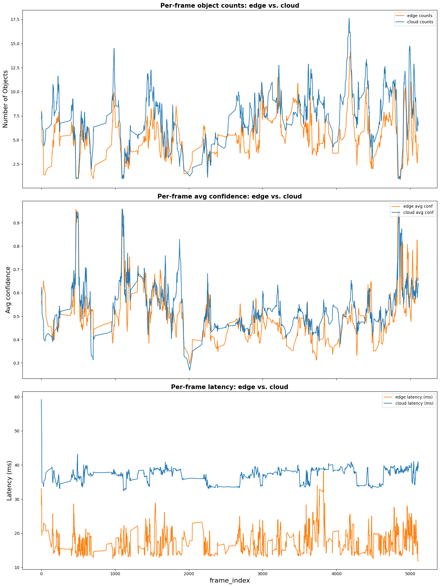

## DISTRIBUTED EDGE–CLOUD AI PIPELINE FOR REAL-TIME VIDEO ANALYTICS

### PROBLEM OVERVIEW

Designing and implementing efficient real-time edge-cloud video analytics AI solutions is a multi-objective optimization problem, which requires an intricate balancing and trade-off between latency, privacy, bandwidth, and accuracy for the specific target application.

This project is a prototype of an edge-cloud video analytics distributed system that prioritizes efficiency and demonstrates the trade-off between cost (i.e., low latency and bandwidth preservation) and quality/accuracy of object detection.

### SYSTEM ARCHITECTURE AND WORKFLOW

This prototype adopts edge-cloud architecture (Edge → Cloud → Dashboard). It incorporates a scene-aware orchestrator. The edge decodes the video, pre-processes frames, and deploys a heuristic motion detector to filter out uninteresting frames.

A lightweight on-edge model conducts inference and selectively offloads frames to the cloud. The cloud performs heavy-weight object detection and returns results to the edge. Concurrently, a Streamlit dashboard reads and displays live metrics.


### LIVE DEMONSTRATION

#### Live annotated video


#### Live Streamlit dashboard


### KEY FEATURES

This prototype features an intelligent edge device equipped with a heuristic frame filter and on-edge lightweight object detection model to reduce reliance on the server. The pipeline performs selective cloud offloading, and the live dashboard displays key performance metrics in near-real time. Furthermore, the system features live displays of the annotated video for monitoring and live observability.


### MAIN DESIGN OBJECTIVES

- Low latency near-real-time object detection
- Bandwidth efficiency by minimizing cloud/server reliance
- Good object detection quality/accuracy
- Provide high monitoring and observability interface for operator's awareness

### KEY TECH STACK

The core building-block packages and tools include Python, Ultralytics (YOLOv8), PyTorch, OpenCV, Flask, and Streamlit. Refer to requirements.txt for the detailed list of dependencies.

### KEY INSIGHTS AND RESULTS

System-level experiments were conducted to assess the impact of system modules/components on the overall pipeline efficiency. Results were analyzed showing the following key insights:
- Object detection quality/accuracy: Utilizing the lightweight edge model and selectively offloading frames to the cloud produces a marginally lower but comparable detection quality/accuracy, and gives a significant boost in detection speed.
- Latency reduction: The edge heuristic filter and lightweight model (i.e., edge intelligence) significantly reduced overall latency (edge inference is approximately 2× faster than cloud).



- Monitoring and observability: The dashboard provides live display of key performance indicators (e.g., latency and bandwidth) and scene analysis (events and objects detected).

- Bandwidth savings: With the heuristic filter set to default, edge intelligence resulted in substantial bandwidth savings (approximately 70%).


## PROJECT STRUCTURE AND DEPLOYMENT GUIDE

### PROJECT ROOT

```
cloud-edge-video-analytics/     <- the project root

├─ cloud/
│  ├─ server.py         # main Flask cloud server: POST /infer
│  └─ utilities.py        # helper functions

├─ common/
│  ├─ frame_content.py    # application level code: intrusion detection
│  ├─ metrics_snapshot.py  # write_metrics_snapshot() to output/metrics_history.json
│  └─ visualize.py        # parse_detections() and annotate_frame()

├─ dashboard/
│  └─ dashboard.py         # this is a streamlit app reads output/metrics_history.json

├─ data/
│  └─ experiment_sample.mp4    # video samples used in the experiments and demo

├─ edge/
│  ├─ orchestrator.py           # orchestrator and main CLI entry interface
│  ├─ cloud_feeder.py      # feed_cloud_jpeg() communicator
│  ├─ edge_model.py        # EdgeModel class: includes lazy import, warmup and lock
│  ├─ preprocess.py       # for heuristic filtering, frame resizing, and converting froms to grayscale
│  └─ video_reader.py     # breaks down video stream to individual frames

├─ experiments/
│  ├─ e_utilities.py       # helper analysis functions
│  └─ experiments.ipynb    # experiments notebook: load JSONs, plots, figures and observations

├─ output/
│  ├─ metrics_history.json     # generated by edge, saves metrics snapshots
│  └─ annotated_output.mp4   # if activated this is where the generated annotated video output

├─ requirements.txt

└─ README.md
└─ CLI_INTERFACE.md
└─ DEPLOYMENT.md

```

### Quick Start

```bash
# From the project root

# 1. Start cloud server
python -m cloud.server --port 5000

# 2. Start dashboard
streamlit run dashboard/dashboard.py

# 3. Start edge orchestrator
python -m edge.orchestrator --video_path "data/experiment_sample.mp4" --server_url "http://127.0.0.1:5000"


NOTE: Amend CLI flags "--video_path" and "--server_url", to conrepond to the video and the current running server URL.
```


